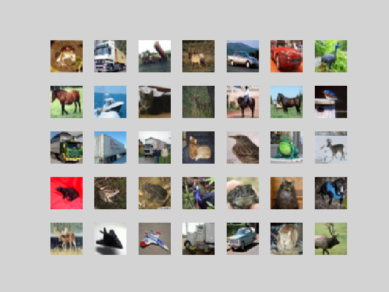

## test/docs/readme

[Check it out][ghpages]

### Theme
: {{ site.theme }}

### site data in _config.yml


- ( {{ forloop.index }} : {{ collection.title }} )


- list
- list

  - list
  - list

{::options parse_block_html="true" /}

- list
- list

word
:  define
word
:  description

=======
[ghpages]: https://yuichiis.github.io/test/
